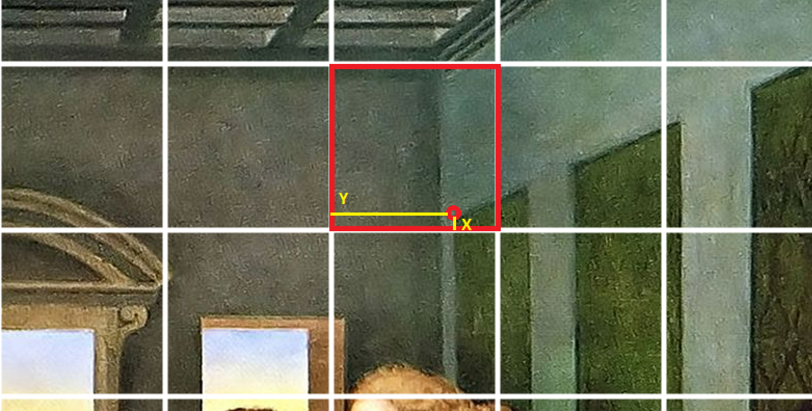

<h1>TraceIt (currently in development)</h1>
<h3>A web application to help painter's trace an image of their choice on canvas</h3>

<h4>Motivation:</h4>

My sister and I enjoy painting. Through years of practice, we got pretty good at it! Now we would want to jump into bigger and more complicated projects. One such project is the recreation of "The Last Supper" painting by Leonardo Da Vinci*  on a 60" x 30" canvas. However, we will change Jesus's face and the one of every apostle with the faces of important characters of our lives. 

*(https://en.wikipedia.org/wiki/The_Last_Supper_(Leonardo))

Working on this big of a scale forces us to work smarter, since we are talking about a lot of materials that could be wasted, but also our time too. Thus, we decided to draw with pencil the image first, using rulers, compasses and whatnot to achieve a drawing that would be as true to the original. Then, we would go over with the oil paint to complete our masterpiece. 

The app I'm building is meant to help with the first part of the process i.e. tracing the image with pencil. Let me show you the process so it becomes more clear how a computer could help:

<h5>1. Creating a grid over the image:</h5>

The app will receive the image to be recreated and the size of the canvas. With those informations, it will draw a grid on the image. This grid will be usefull for the painter, since he will be able to easily find important coordinates. 

<h5>2. Drawing a grid on the canvas:</h5>

The painter will draw a grid on the canvas based on the grid that was calculated by the app. 

<h5>3. Finding important coordinates and sketching:</h5>

Having sketched the grid, the user will be able to easily find important coordinates on the image simply by clicking on the point of the image he whishes to draw. On click, the app will indicate to the user how to pin point the important coordinate with a relative coordinate based on a sub-grid formed by edges of the grid-square in which the point is contained. An example with an image helps us understand better:

With an absolute path, we would get a coordinate based on a grid which has as origin the bottom left corner of the canvas. This makes the job of finding the point tedious, especially with bigger canvases where a 12 inch ruler won't do the job.

  

With a relative path, we would get a coordinate based on a grid which has as origin the bottom left corner of the containing square. This facilitates the job for the user to find the point using a normal ruler.

 

<h3>How to use:</h3>
